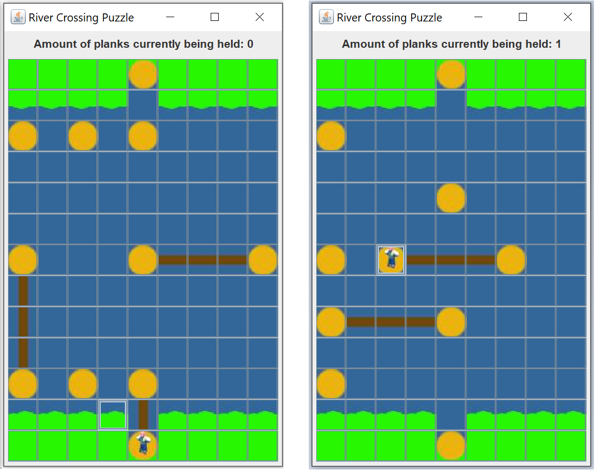

# Riverpuzzle
Simple puzzle game made in Java using Swing components

## Controls

- Left Mouse Button  = to move the player.
  
- Right Mouse Button = to remove planks.
  
- Mouse Wheel Button = to place planks.

## Screenshots

